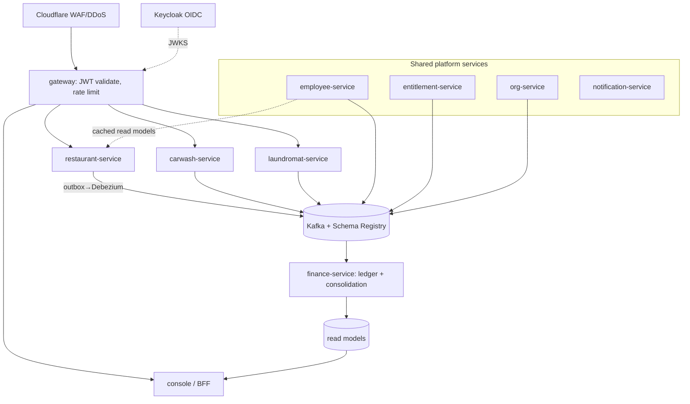

# Service Architecture

> Product: **Native**. Package root: `id.co.example.<service>` — replace `example` with your org domain.

**Native** — a multi-tenant B2B SaaS for an owner running several businesses: a per-company management console over independently deployable vertical services, a shared platform layer, an event-driven financial consolidation core, and an integrated HR module. **Localized** (English / Bahasa Indonesia, more later) and **multi-currency** (IDR / USD, more later). **Microservices architecture, deployed pragmatically** — the first usable slice ships as one or two units; services split out as load grows.

---

## 1. Topology

**Rules of the topology** (also in CLAUDE.md):
- Each service owns its own database. No shared DB, no cross-service joins.
- Business services never call each other or call platform services synchronously. They subscribe to events and read local cached projections. The only synchronous edge is the gateway validating a JWT.
- The finance-service is purely downstream — a consumer of events, never a dependency.
- All event publishing is via the transactional outbox; Debezium tails it to Kafka.

---

## 2. Services

Each entry: **Responsibility · Owns · Publishes · Consumes · Notes.**

### Identity — *Keycloak (configuration, not code)*
- **Responsibility:** authentication, token issuance.
- **Owns:** realms, clients, users.
- **Publishes/Consumes:** —
- **Notes:** Issues short-lived RS256 JWTs carrying `sub`, `company_id`, and roles. Every service validates the signature locally (JWKS); never trust the gateway alone.

### gateway — *Spring Cloud Gateway*
- **Responsibility:** edge routing, JWT validation, per-tenant rate limiting.
- **Owns:** routing config.
- **Notes:** Injects authenticated context downstream. Redis-backed token-bucket rate limit per `company_id` + user.

### org-service
- **Responsibility:** the tenant structure — owner/account, company (legal employer), business unit, branch, outlet, team, and the org tree.
- **Owns:** `account`, `company` (incl. `base_currency` **[immutable]** and `default_language`, both set at creation), `org_unit` (self-referencing: type = business_unit | branch | outlet | team), `legal_employer`.
- **Publishes:** `CompanyCreated`, `OrgUnitCreated`, `OrgUnitChanged`.
- **Consumes:** —
- **Notes:** Foundational; nearly every other service caches its slice of this tree. The company is the keystone boundary (console scope = legal employer = consolidation scope = entitlement scope). **Base currency and default language are set in the company-creation flow and stored here — base currency is effectively immutable once transactions exist; the dashboard never toggles them.**

### entitlement-service
- **Responsibility:** which modules each company has, and billing lines.
- **Owns:** `module_catalog`, `tenant_entitlement`, `billing_line`.
- **Publishes:** `EntitlementGranted`, `EntitlementRevoked`.
- **Consumes:** `CompanyCreated`.
- **Notes:** Ships a shared `entitlement-check` library used at three gates — shell render, event ingestion, billing. Entitlement state is cached in Redis and invalidated by its events.

### employee-service (HR — internally modular, one service)
- **Responsibility:** the canonical employee and everything HR — records, contracts, assignments, compensation, payroll, leave.
- **Owns:** `employee` (incl. `ptkp_status`), `employment_contract` (incl. `employment_type`), `assignment` (org_unit, `reporting_to`, role, effective dates), `management_scope`, `compensation_package`, `earning_rule`, `pay_component` (incl. `gl_account`), `statutory_rule` (versioned, effective-dated), `payroll_run`, `payslip_line` (stamps `rule_version`), `leave_*`.
- **Publishes:** `EmployeeChanged`, `AssignmentChanged`, `PayrollPosted`, `LaborCostAllocated`.
- **Consumes:** `MetricPublished` (for variable pay), `PeriodSealed` (completeness gate), `OrgUnitChanged`, `EntitlementGranted/Revoked`.
- **Notes (key invariants):**
  - Org/team/manager live on the **assignment**, not the employee; an employee holds multiple concurrent assignments.
  - Concurrent assignments must all resolve to the **same `legal_employer`** — enforce at assignment creation (reject cross-company concurrency).
  - Payroll for multi-branch staff is **aggregate-then-allocate**: each assignment's gross runs independently; statutory (BPJS, PPh 21) is computed **once** on the person's combined total; cost is allocated back to each outlet by earnings share.
  - Payroll is a data-driven rules engine; payslip lines stamp `rule_version` for byte-identical re-runs. **Seed real current-year Indonesian statutory figures, verified against DJP and BPJS.**
  - Internally sub-modular (records, assignments, compensation, payroll, leave); split payroll into its own service only under real pressure.

### finance-service (financial core)
- **Responsibility:** the financial plane — chart of accounts, mapping rules, dimensional ledger, consolidation (within-company + group elimination), read models.
- **Owns:** `chart_of_account`, `mapping_rule` (versioned, effective-dated), `ledger_posting` (append-only, **Money** = minor units + currency, partitioned by tenant + period), `consolidation_ledger` (elimination/adjustment entries), `fx_rate` (effective-dated exchange rates), `read_model_*`.
- **Publishes:** `ConsolidationClosed`. Exposes a query API for dashboards.
- **Consumes:** `SaleRecorded`, `ExpenseRecorded`, `PayrollPosted`, `LaborCostAllocated`.
- **Notes:** Within-company consolidation = dimensional aggregation. Group consolidation = sum company trial balances + intercompany elimination in the separate `consolidation_ledger` (never touches a company's own books). Related-party tagging drives automatic elimination. CQRS: resolve/post on write, aggregate on read. **Owns currency: amounts are stored in their transaction currency; a chosen presentation currency is produced via `fx_rate` (a view-only convenience), and cross-currency group consolidation uses defined translation rates — closing rate for balances, average for the P&L.**

### notification-service
- **Responsibility:** email/push delivery.
- **Owns:** `notification`, `delivery_receipt`.
- **Publishes:** delivery receipts.
- **Consumes:** trigger events (e.g. approval requests).

### restaurant-service / carwash-service / laundromat-service (verticals)
- **Responsibility:** operations for one business type; system of record for its ops.
- **Owns (restaurant):** `order`, `sale`, `menu_item`. (carwash: `wash`, `bay`, `upsell`. laundromat: `cycle`, `kilo_log`.)
- **Publishes:** `SaleRecorded`, `ExpenseRecorded`, `LaborEvent`, `MetricPublished` (per-employee/shift/outlet metrics for commission), `PeriodSealed`.
- **Consumes:** `EmployeeChanged`, `AssignmentChanged` (→ local staff read model), `EntitlementGranted/Revoked`, `OrgUnitChanged`.
- **Notes:** Each vertical = its own micro-frontend remote (Module Federation) registered in the shell. Declares its metric contract: which `metric_key`s it emits, at which grains (employee / shift / outlet). The validation layer rejects commission rules requesting grains the vertical can't emit.

### shell / BFF
- **Responsibility:** per-company micro-frontend host; aggregates dashboard reads.
- **Owns:** —
- **Notes:** One instance per company (login = enter a company workspace). Loads the micro-frontends for the business-unit types present and presents consolidated dashboards from the finance-service read models via a backend-for-frontend (one call from the shell, fan-out behind it).

---

## 3. Cross-cutting

**Tenant isolation.** Every row carries `company_id`. Every query is scoped by it AND enforced a second time by PostgreSQL **row-level security** keyed to the session tenant (set from the JWT). Defense in depth: a forgotten `WHERE` can't leak across companies. Propagate the tenant via **scoped values** (Java 25) across virtual threads, not ThreadLocal.

**Eventing.** Avro schemas in the Schema Registry (backward-compatible only). Transactional outbox + Debezium for reliable publishing. Consumers are idempotent (dedupe by event id/key). The **event catalog** (§5) is the inter-service contract — read it before touching any event.

**Cached read models + hydration.** Services keep local projections of data they need from others, updated by events. New/redeployed services hydrate from **log-compacted topics** plus a **snapshot/bootstrap API**, and serve a "warming up" status until caught up. Never replay from the start of an uncompacted topic.

**Audit.** Every table extends `Auditable` (`created_at/by`, `updated_at/by`, `version`, `company_id`); the actor comes from the JWT via `AuditorAware`, or the service name for system changes. Full before/after history is captured by **Debezium CDC** to an append-only audit store (not by per-table code; not on derived read models). Financial postings and payroll changes additionally write a **hash-chained immutable log**.

**Money & currency.** Every monetary value is a **Money** type — an integer in minor units plus an ISO-4217 currency code, never a float. Each posting stores its transaction currency. Display is locale-aware via `Intl.NumberFormat` (correct symbol, grouping, and decimals per currency). A company's **base currency** is set at creation and immutable; presentation-currency views and cross-currency consolidation go through the finance-service `fx_rate` table.

**Internationalization (i18n).** No user-facing string is hardcoded — all UI copy resolves through **react-i18next** keys, with one locale file per language (`en`, `id`, more later; adding a language = adding a file). The active locale also drives all number, date, and currency formatting via `Intl`. A company sets a **default language** at creation; each user may override it in their profile.

**Security.** mTLS between services via Linkerd (added at split time). Secrets via Vault (dynamic short-TTL DB creds). TLS 1.3 in transit, KMS at rest, **field-level encryption for PII** (salary, NIK, bank account) — never logged. SonarQube + dependency scanning + image signing as hard CI gates.

**Observability.** OpenTelemetry everywhere → Prometheus/Grafana (metrics), Tempo/Jaeger (traces), Loki (logs). Distributed tracing is mandatory — a request crosses services.

---

## 4. Distributed-correctness gates (the hardened bits — do not skip)

- **Payroll completeness.** Verticals emit `PeriodSealed` when a period's metrics are final; a payroll run waits until every expected source has sealed before computing. No running on partial data.
- **Consolidation close.** Lock the period, run intercompany matching, flag mismatches (A's receivable ≠ B's payable), then publish `ConsolidationClosed`. Never present a mid-flight consolidation as final.
- **Read-model hydration.** Log-compacted topics + snapshot API; "warming up" until caught up (above).

---

## 5. Event catalog (starter — keep current in `docs/EVENT-CATALOG.md`)

| Event | Producer | Consumers | Key fields |
|---|---|---|---|
| `CompanyCreated` | org-service | entitlement, finance, verticals | company_id, legal_employer_id, base_currency, default_language |
| `OrgUnitCreated/Changed` | org-service | employee, verticals, finance | org_unit_id, type, parent_id, company_id |
| `EntitlementGranted/Revoked` | entitlement | shell, all services | company_id, module_key |
| `EmployeeChanged` | employee | verticals | employee_id, company_id, status |
| `AssignmentChanged` | employee | verticals, finance | employee_id, org_unit_id, reporting_to, effective_from/to |
| `MetricPublished` | verticals | employee | metric_key, period, grain, subject_id, value, source_business_id |
| `PeriodSealed` | verticals | employee, finance | business_id, period |
| `SaleRecorded` | verticals | finance | sale_id, company_id, business_id, amount, occurred_at |
| `ExpenseRecorded` | verticals | finance | expense_id, company_id, business_id, amount, gl_hint |
| `PayrollPosted` | employee | finance | payroll_run_id, run_seq, company_id, period, base_currency, totals, uses_illustrative_rules |
| `LaborCostAllocated` | employee | finance | payroll_run_id, run_seq, company_id, period, outlet_id, gl_account, amount_minor, currency, uses_illustrative_rules, unallocated |
| `ConsolidationClosed` | finance | shell, notification | company_id (or group_id), period |

> **`LaborCostAllocated` grain — finance sign-off (#23).** The starter list above formerly carried
> `employee_id`. It is **DROPPED**: the event is **aggregated per `(outlet_id, gl_account)` bucket**,
> not per person. A per-`(employee, outlet, gl)` amount would effectively leak an individual's labor
> cost ≈ salary (**rule 6 PII**), and the dimensional ledger gains nothing from it — finance's
> dimensions are `company_id, business_id (= outlet), period, gl_account_code, posting_type`; it never
> needs `employee_id`. **Finance consumes the aggregated bucket and is fully served.** This is the
> recorded **finance sign-off** that resolves the EVENT-CATALOG `LaborCostAllocated` open-risk note.
>
> **`run_seq` on both events.** `run_seq` is added to **both** `PayrollPosted` and `LaborCostAllocated`
> (backward-compatible, union-with-default on the wire — `default 1` so an old reader sees the first
> run). It is the explicit **supersession** signal finance keys on: a higher `run_seq` for the same
> `(company_id, period)` supersedes lower runs (finance reverses-and-reposts, append-only). The
> producer already keys its outbox UNIQUE on `(company_id, period, run_seq)`.
>
> **Small-count (k=1) residual — accepted.** When an outlet has exactly one employee in the period,
> its `(outlet, gl)` bucket amount **equals that one person's allocated labor cost** — the aggregation
> does not hide the individual's figure. This is an **accepted, signed-off residual**: the dimensional
> ledger legitimately needs outlet-level labor cost, the figure is the outlet's *real* cost, and access
> is gated by **RLS + finance-role authorization** (only users entitled to the company's books). It is
> **not** mitigated by suppression — suppression would break the exact-sum reconciliation and the P&L.
> Documented here so it is a conscious contract decision, not an oversight.

---

## 6. Frontend

Two surfaces by persona, over the same backend, sharing one design system and i18n setup.

**Management console** (`/apps/console`) — the owner/manager surface. Vite + React + TypeScript + Tailwind + shadcn/ui + TanStack Query + Recharts. Desktop-first; a micro-frontend shell (Module Federation) hosting per-vertical admin remotes plus consolidation dashboards, HR, and entitlement modules. One instance per company; managers see a scope-limited view. Reads company config (base currency, default language) — **no currency or language toggle.**

**Employee app** (`/apps/employee`) — the worker surface (phase 2/3). Mobile-first PWA: schedule, payslip, leave, and the operational POS. Separate codebase and deployable; native (React Native) only later if the POS needs offline or hardware support.

**Shared** (`/apps/ui`) — the design system and the react-i18next locale files (`en`, `id`). Both apps authenticate via Keycloak (the role decides which app and what's visible), reach the gateway through a per-app BFF, and format money and dates via `Intl`.

---

## 7. The first usable slice (validation milestone) — minimal scope

Ship the **thinnest end-to-end loop** and put it in front of the people who requested the app, before building anything else. Deploy as **one or two units** (e.g. a single deployable bundling the slice's services), not the full split.

**In scope (minimal):**
- **Identity + gateway:** a user logs in; JWT carries `company_id`.
- **org-service (minimal):** create one company — **setting its base currency and default language** — with one business.
- **Onboarding wizard:** the creation flow where base currency + default language are chosen (not dashboard toggles).
- **restaurant-service (minimal):** record a sale → emit `SaleRecorded` (via outbox), amount as **Money** in the base currency.
- **finance-service (minimal):** consume `SaleRecorded`, post to the ledger, expose consolidated revenue. Single base currency, **no FX yet**.
- **console (minimal):** login, a record-sale form, a dashboard showing consolidated revenue — **localized (en/id) and formatted via `Intl` in the company base currency; no currency or language toggle.**

**Explicitly deferred** until the slice is validated: employees and payroll, entitlements (treat as fully entitled), the other verticals, group consolidation/eliminations (one company only), the full org tree, Linkerd, Vault, full observability. Add the heavy platform pieces as you split services under real load.

This proves the architecture's core loop — operations → event → finance → consolidated dashboard — with the least possible code, and converts interested users into actual users while their interest is warm.
